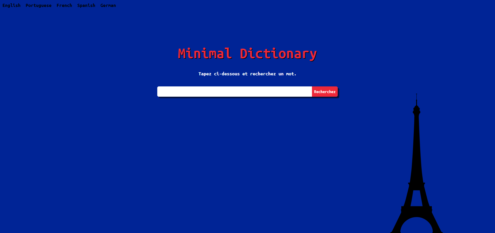

# Dictionary

A minimalist dictionary built with JavaScript that supports 5 languages*.

## English

## French

## Portuguese

## Spanish

## German

*Portuguese support has been shut down by the API creator.
